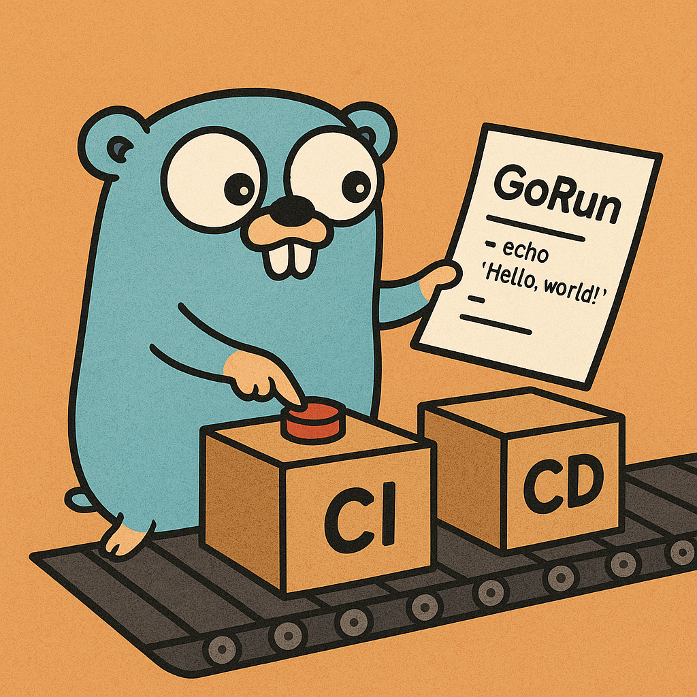

# GoRun

**GoRun** is a lightweight, API-based CI/CD orchestration tool written in Go 🐹. It is designed to process declarative YAML pipelines and execute jobs across stages with clear dependency resolution and tracking.  
GoRun supports multi-pipeline execution, tracks job states, manages execution queues, and provides a solid foundation for building scalable automation workflows.

### Features

- YAML-defined pipelines
- Persistent queue for job scheduling
- Designed for future user & project multi-tenancy

> 🚀 Ideal for developers looking for a simple, Go-native CI/CD runner to embed in open source or internal tools.

---

### 🤝 Contribute

GoRun is in its early stages and actively evolving!  
If you're passionate about Go, CI/CD, or want to be part of shaping an open-source automation tool from the ground up — **contributions are more than welcome**.

Whether it's ideas, bug reports, code, documentation, or just a star — your involvement is appreciated!

Let’s build something great together 🚀